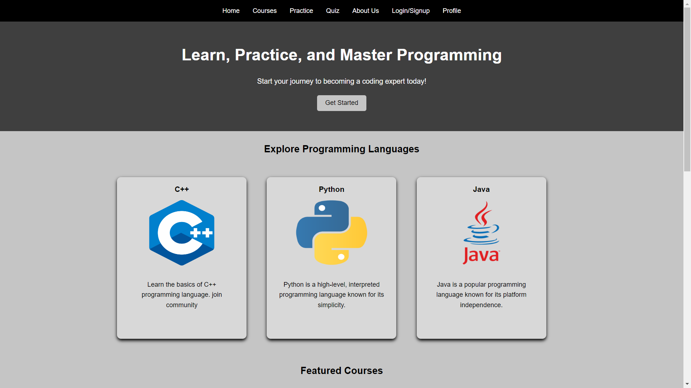
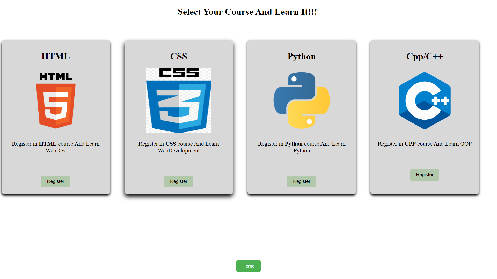
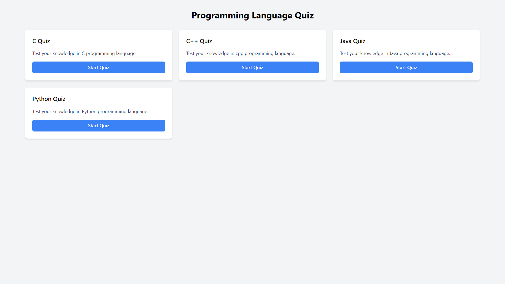
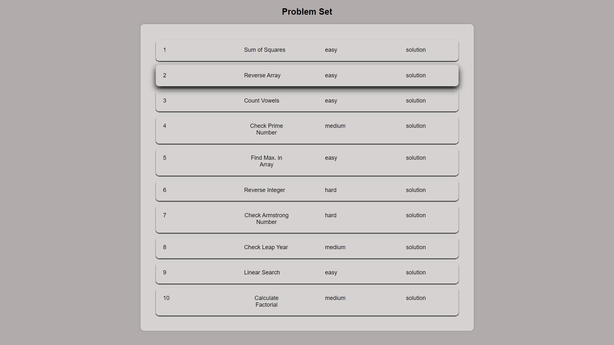
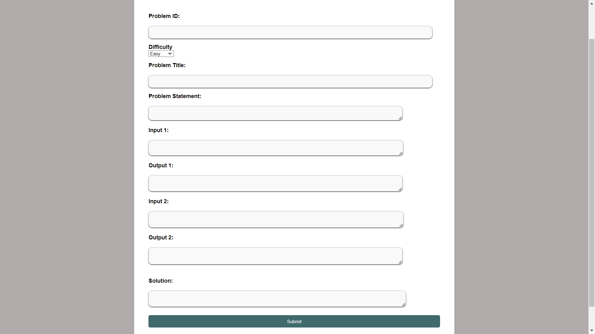

# CodeAcademy

## Overview
CodeAcademy is a web application designed to help users learn programming languages, practice coding, and take quizzes. It provides a platform for both learning and assessment.

### Home Page

### Course Page

### Quiz Page

### Problem Set Page

### Add Problem Form

## Features

### For Users:
- **Learning:** Users can access resources to learn various programming languages.
- **Practice:** Users can practice coding problems provided by the platform.
- **Quizzes:** Users can take quizzes to test their knowledge.

### For Admins:
- **Static Page Management:** Admins can add static pages for educational content.
- **Problem Set Management:** Admins can add coding problems for users to practice.

## How It Works

### Learning:
- Users can access tutorials, articles, and guides on different programming languages.

### Practice:
- Users can solve coding problems provided by the platform.
- They can submit their solutions and receive feedback.

### Quizzes:
- Users can take quizzes on different programming topics.
- Quizzes are automatically graded, and users receive instant feedback.

### Admin Panel:
- Admins have access to features for managing static pages and problem sets.
- They can add new content and update existing ones.

### Request Handling:
- The application handles requests using `app.get` and `app.post` methods in `app.js`.
- When a user interacts with the application, whether by accessing a page or submitting a form, the corresponding route in `app.js` is triggered to process the request.

### Database Connection:
- The application establishes a connection to the database in `db.js`.
- This file contains the necessary configuration to connect to the MySQL database where user data, problem sets, and other information are stored.
- By separating the database connection logic into a separate file, the application follows the principles of modularity and separation of concerns.

## Installation
1. Clone the repository.
2. Install dependencies using `npm install`.
3. Set up the database connection in `db.js`.
4. Run the application using `node app.js`.
5. Change dataase password and name from db.js
6. import datbase from databse_tables  to mysql workbench
7. Run app.js file

## Technologies Used
- Node.js
- Express.js
- MySQL
- HTML
- CSS
- JavaScript
- EJS
- CodeMirror
- Quill.js

## Contributors / Team Members
- Vipul Lakum
- Yash Gabani
- Meet Thakkar
- Meet Antala

